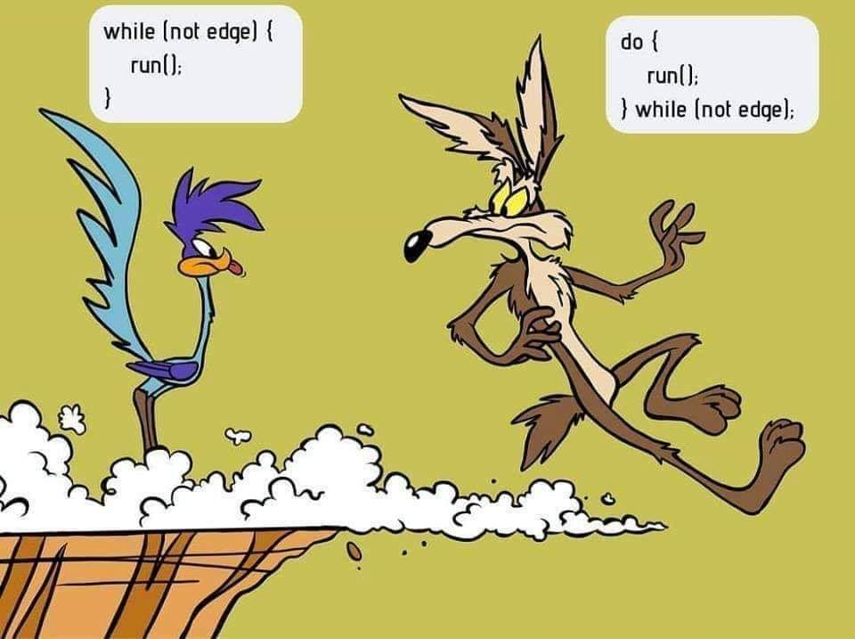

<h1 align="center">
<strong>AUT_BP_2024_Fall Homework 2</strong>
</h1>

<p align="center">
<strong> Deadline: 18th of Aban - Friday - 23:59 o'clock</strong>
</p>

---

## 1st Question: Prime Numbers up to a Specified Number

### Description

Write a program that takes a positive integer, `n`, as input and outputs all prime numbers less than or equal to `n`. A prime number is a natural number greater than 1 with no positive divisors other than 1 and itself. The program should include `n` in the output if `n` itself is a prime number.

The student should:

1. Prompt the user to enter a positive integer.
2. Use a loop to check for prime numbers from 2 up to `n`.
3. Print each prime number in a single line or as part of a list, whichever format is preferred.

### Example of Input/Output

-   **Example 1:**
    -   **Input:** `10`
    -   **Output:** `2, 3, 5, 7`
-   **Example 2:**

    -   **Input:** `20`
    -   **Output:** `2, 3, 5, 7, 11, 13, 17, 19`

-   **Example 3:**
    -   **Input:** `2`
    -   **Output:** `2`

### Edge Cases and Pitfalls

1. **Input less than 2**: If `n` is less than 2 (e.g., 1 or 0), no prime numbers should be output, as there are no prime numbers less than 2. Ensure the program handles this correctly without attempting any calculations.

2. **Non-integer input**: Ensure the program only accepts positive integer inputs. If the user enters a negative number, zero, or a non-integer value, the program should prompt the user again or handle this scenario gracefully (e.g., by outputting an error message).

3. **Prime limit inclusion**: If `n` itself is a prime number, it should be included in the output. For example, if `n = 13`, the output should include 13.

4. **Efficiency for larger values of `n`**: For large values of `n`, checking every number up to `n` can be inefficient. Optimizations like checking divisors up to the square root of each number or skipping even numbers after checking 2 can make the program faster. However, such optimizations are optional at this level.

---

## 2nd Question: Fibonacci Series Generator

### Description

Write a program that takes a positive integer `n` as input and outputs the `n`th number in the Fibonacci series. The Fibonacci series is a sequence of numbers where each number is the sum of the two preceding ones, starting from 0 and 1. That is:

<p align="center">

</p>

The program should:

1. Prompt the user to enter a positive integer `n`.
2. Calculate the `n`th Fibonacci number using a loop.
3. Output the `n`th Fibonacci number.

### Example of Input/Output

-   **Example 1:**
    -   **Input:** `5`
    -   **Output:** `5`
-   **Example 2:**

    -   **Input:** `10`
    -   **Output:** `55`

-   **Example 3:**

    -   **Input:** `1`
    -   **Output:** `1`

-   **Example 4:**
    -   **Input:** `50`
    -   **Output:** `12586269025`

### Edge Cases and Pitfalls

1. **Large values of `n`**: As `n` grows, Fibonacci numbers grow very quickly. For very large values of `n` (e.g., `n > 50`), the program could run slowly or even overflow if not handled properly. While advanced optimization techniques (like memoization) aren’t necessary at this stage, it’s good to be mindful of this potential issue.

2. **Negative or non-integer input**: The program should handle invalid inputs (e.g., negative numbers, zero, or non-integer inputs) gracefully by either prompting the user again or displaying an error message.

3. **Recursive vs Iterative Solution**: Although recursion is a common method for Fibonacci sequences, an iterative solution is a must here to avoid stack overflow and inefficient computations at this level.

---

## 3rd Question: Multiplication Table Generator

### Description

Write a program that takes a positive integer `n` as input and generates an `n x n` multiplication table. The table should start from `1 * 1` at the top-left corner and go up to `n * n` at the bottom-right corner. Each cell in the table represents the product of the corresponding row and column numbers.

The program should:

1. Prompt the user to enter a positive integer `n`.
2. Use nested loops to calculate and display each product in an `n x n` grid format.

### Example of Input/Output

-   **Example 1:**

    -   **Input:** `3`
    -   **Output:**
        ```
        1  2  3
        2  4  6
        3  6  9
        ```

-   **Example 2:**
    -   **Input:** `5`
    -   **Output:**
        ```
        1   2   3   4   5
        2   4   6   8  10
        3   6   9  12  15
        4   8  12  16  20
        5  10  15  20  25
        ```

### Edge Cases and Pitfalls

1. **Input of 1**: When `n = 1`, the output should be just `1`, as the table consists of only one cell (1 \* 1).

2. **Non-positive inputs**: Ensure the program only accepts positive integers for `n`. If the user enters zero, a negative number, or a non-integer, the program should handle it gracefully, either by displaying an error or prompting the user again.

3. **Spacing and Alignment**: For larger tables, the output could become misaligned. Consider formatting each cell’s output with consistent width for readability, especially for double- or triple-digit numbers.

---

### 4th Question: Rhombus Pattern Printing

#### Description

Write a program that takes a positive integer `n` as input and prints a symmetric rhombus pattern made of asterisks (`*`). The rhombus will have a maximum width of `n` stars at its center and a total height of `2n - 1` rows. The pattern should be well-formatted and aligned so that the rhombus shape appears centered.

The program should:

1. Prompt the user to enter a positive integer `n`.
2. Print a rhombus pattern where:
    - The first row starts with `n - 1` spaces followed by 1 star.
    - Each subsequent row increases by one star until the middle, reaching a width of `n` stars.
    - After reaching the middle row, each following row decreases by one star until there’s only 1 star on the last row.

#### Example of Input/Output

-   **Example 1:**

    -   **Input:** `3`
    -   **Output:**
        ```
          *
         ***
        *****
         ***
          *
        ```

-   **Example 2:**
    -   **Input:** `4`
    -   **Output:**
        ```
           *
          ***
         *****
        *******
         *****
          ***
           *
        ```

#### Edge Cases and Pitfalls

1. **Input of 1**: If `n = 1`, the output should simply be a single star, as a rhombus with width 1 only has one central point.

    - **Example Input:** `1`
    - **Output:**
        ```
        *
        ```

2. **Non-positive or Non-integer Input**: Ensure the program handles cases where the input is not a positive integer. If the user enters zero, a negative number, or a non-integer, the program should display an error message or prompt for valid input again.

3. **Spacing and Alignment**: The pattern must be formatted correctly so that the rhombus is symmetric. Ensure the correct number of spaces is printed before the stars on each line, especially for larger values of `n`.

---

### 5th Question: GCD and LCM Finder

#### Description

Write a program that takes two positive integers as input and calculates both the Greatest Common Divisor (GCD) and the Least Common Multiple (LCM) of these numbers.

-   **GCD (Greatest Common Divisor)**: The largest positive integer that divides both numbers without leaving a remainder. For example, the GCD of 12 and 18 is 6.
-   **LCM (Least Common Multiple)**: The smallest positive integer that is a multiple of both numbers. For example, the LCM of 12 and 18 is 36.

The program should:

1. Prompt the user to enter two positive integers.
2. Output both the GCD and the LCM of the numbers.

#### Example of Input/Output

-   **Example 1:**

    -   **Input:** `12 18`
    -   **Output:**
        ```
        GCD of 12 and 18 is 6
        LCM of 12 and 18 is 36
        ```

-   **Example 2:**
    -   **Input:** `8 20`
    -   **Output:**
        ```
        GCD of 8 and 20 is 4
        LCM of 8 and 20 is 40
        ```

#### Edge Cases and Pitfalls

1. **Input of 1**: When one of the numbers is 1, the GCD is always 1, and the LCM is the other number.

    - **Example Input:** `1 15`
    - **Output:**
        ```
        GCD of 1 and 15 is 1
        LCM of 1 and 15 is 15
        ```

2. **Same Numbers**: If both numbers are the same, the GCD and LCM will also be that number.

    - **Example Input:** `10 10`
    - **Output:**
        ```
        GCD of 10 and 10 is 10
        LCM of 10 and 10 is 10
        ```

3. **Non-positive or Non-integer Input**: The program should only accept positive integers as input. If the user enters zero, a negative number, or a non-integer, the program should display an error message or prompt for valid input again.

---

### 6th Question: Spiral Matrix Generator

#### Description

Write a program that takes a positive integer `n` as input and generates an `n x n` matrix filled with numbers in a spiral order, starting from 1 in the top-left corner and ending with `n * n` at the center. The matrix should be filled by spiraling inward in a clockwise direction, so the numbers proceed in the following order: right, down, left, and up, repeating this pattern until the matrix is filled.

The program should:

1. Prompt the user to enter a positive integer `n`.
2. Use nested loops and an array to fill the matrix in a spiral pattern.
3. Print the resulting `n x n` matrix with each number aligned in rows and columns.

#### Example of Input/Output

-   **Example 1:**

    -   **Input:** `3`
    -   **Output:**
        ```
        1 2 3
        8 9 4
        7 6 5
        ```

-   **Example 2:**

    -   **Input:** `4`
    -   **Output:**
        ```
        1  2  3  4
        12 13 14 5
        11 16 15 6
        10  9  8 7
        ```

-   **Example 3:**
    -   **Input:** `5`
    -   **Output:**
        ```
        1  2  3  4  5
        16 17 18 19 6
        15 24 25 20 7
        14 23 22 21 8
        13 12 11 10 9
        ```

#### Edge Cases and Pitfalls

1. **Input of 1**: When `n = 1`, the output should be a single cell containing the number 1, as a spiral of size 1 has only one element.

    - **Example Input:** `1`
    - **Output:**
        ```
        1
        ```

2. **Odd vs. Even Sizes**: Ensure that the spiral pattern works for both odd and even values of `n`. Odd dimensions will have a single center point, while even dimensions will not.

3. **Non-positive or Non-integer Input**: Ensure the program handles cases where the input is not a positive integer. If the user enters zero, a negative number, or a non-integer, the program should display an error message or prompt for valid input again.

4. **Formatting for Larger Numbers**: As `n` increases, the values in the matrix will grow. The program should format the output properly to maintain alignment, especially with larger numbers (e.g., `n = 10` will produce values up to 100).

5. **Out-of-Bounds Indexing**: When implementing the spiral logic, care should be taken to avoid indexing outside the bounds of the array. Ensure each move respects the current boundaries of the matrix, which shrink as the spiral progresses inward.

---

## Contact

If you have any questions regarding the homework, feel free to reach out:

-   **Teaching Assistant**: Seyyed Mohammad Hamidi
-   **Telegram**: [t.me/rsmhamidi](https://t.me/rsmhamidi)
-   **Telegram Group**: [t.me/AUT_BP_Fall_2024](https://t.me/AUT_BP_Fall_2024)
-   **Github**: [github.com/smhamidi](https://github.com/smhamidi)

---

<p align="center">
  
</p>

**Best Regards, [Hamidi](https://github.com/smhamidi)**
